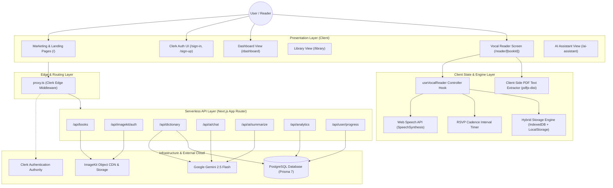
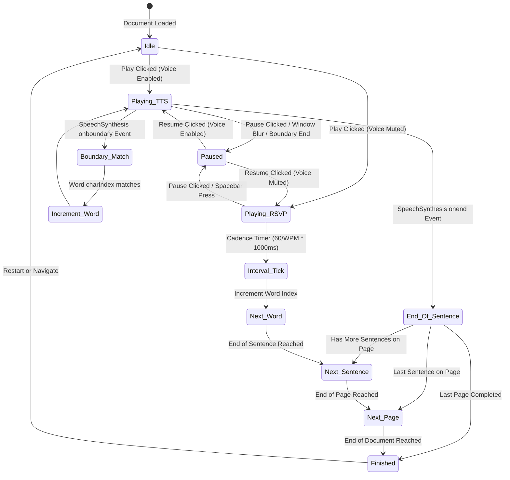

# GoalBook Architecture & System Design 📐

This document outlines the architecture, data flow, state management, component tree, and security models of GoalBook.

---

## 1. High-Level Architecture Overview

GoalBook is structured as a **hybrid cloud/local single-page application (SPA)** powered by **Next.js 16 (App Router)** and **React 19**.



---

## 2. Component Hierarchy & Layout Structure

GoalBook uses Next.js Route Groups to isolate layouts and authorization domains:

```plaintext
app/
├── layout.tsx (Root Layout: ClerkProvider, Inter Fonts, Dark Theme, JSON-LD SEO)
│
├── (marketing)/
│   ├── layout.tsx (Public Shell: Landing Navbar, Mobile Menu, Footer)
│   ├── page.tsx (Hero, Value Propositions, APK Download, FAQ, Interactive Demo)
│   ├── about/page.tsx (Mission, Team, Speed-reading Philosophy)
│   ├── pricing/page.tsx (Free vs Pro vs Scholar Tier comparison)
│   ├── contact/page.tsx (Inquiry and support form)
│   ├── privacy/page.tsx (GDPR & Data Privacy policies)
│   └── terms/page.tsx (Terms of Service)
│
├── (auth)/
│   ├── layout.tsx (Centered Auth Card with ambient radial gradients)
│   ├── sign-in/page.tsx (Clerk <SignIn /> wrapper)
│   ├── sign-up/page.tsx (Clerk <SignUp /> wrapper)
│   └── forgot-password/page.tsx (Self-service recovery flow)
│
└── (dashboard)/
    ├── layout.tsx (Top Dashboard Navigation, User Button, Library Links)
    ├── dashboard/page.tsx (Analytics overview, Recharts streak graph, Continue Reading)
    ├── library/page.tsx (Comprehensive Grid of IndexedDB + ImageKit PDFs, Filter/Search)
    ├── ai-assistant/page.tsx (Full-screen Gemini chat & document research workspace)
    └── reader/[bookId]/page.tsx (Core split-pane teleprompter, audio controls, sidebar, AI drawer)
```

---

## 3. Reading Engine State Machine

The core reading experience in [`hooks/useVocalReader.ts`](file:///home/kartik/Documents/GoalBook/MicroServers/GoalReader_web/hooks/useVocalReader.ts) operates as a finite state machine:



---

## 4. Hybrid Storage Strategy

Reading dense documents demands zero latency and resilience against spotty internet connections. GoalBook employs a tiered storage architecture:

| Storage Layer | Medium | Lifespan | Data Contained | Typical Latency |
|---|---|---|---|---|
| **L1: Active Memory** | React State / Ref | Session | Active sentence, word index, canvas refs, utterance queue | `< 1ms` |
| **L2: Metadata Cache** | LocalStorage | Persistent | Book titles, progress percentages, last-read timestamps | `< 2ms` |
| **L3: Offline Binary/Text** | IndexedDB (`VocalReaderDB`) | Persistent | Parsed sentences, word arrays, spatial metadata per page | `< 15ms` |
| **L4: Cloud Storage** | ImageKit.io CDN | Permanent | Raw PDF binary files isolated per user folder (`/vocal_reader/${userId}/`) | `~200ms` |
| **L5: Cloud Relational** | PostgreSQL (Prisma 7) | Permanent | User bookmarks, vocab dictionary, AI chat history, analytics | `~80ms` |

### Synchronization Flow:
1. When a user uploads a PDF in [`components/PDFUploader.tsx`](file:///home/kartik/Documents/GoalBook/MicroServers/GoalReader_web/components/PDFUploader.tsx):
   - Browser client parses the binary immediately using `extractTextFromPDF()`.
   - The parsed document is written directly into browser `IndexedDB`.
   - Concurrently, if the user is signed into Clerk, a background direct upload sends the PDF to ImageKit with signed credentials from `/api/imagekit/auth`.
2. As the user reads:
   - Every word or sentence advancement triggers a debounced (1,000ms) save to `IndexedDB` and `LocalStorage`.
   - Reading progress bookmarks are transmitted asynchronously to `/api/user/progress`.

---

## 5. Security & Authentication Architecture

- **Edge Route Protection (`proxy.ts`)**: GoalBook executes Clerk's edge middleware to authenticate requests. Public routes (`/`, `/about`, `/pricing`, `/sign-in`, `/sign-up`, etc.) bypass authentication; all dashboard and mutating API endpoints require an active session token.
- **Folder Isolation in Object Storage**: ImageKit uploads are constrained to the authenticated user's ID (`/vocal_reader/${userId}/`), preventing cross-tenant access to uploaded documents.
- **Client-Side File Parsing**: PDFs are processed client-side via WebAssembly/Web Workers in `pdfjs-dist`, ensuring that unauthenticated or private documents do not transit application servers unless explicitly synced to cloud storage.
- **Database Multitenancy**: In PostgreSQL, every `Book`, `ReadingProgress`, `AIChat`, and `SavedWord` row is strictly constrained by a foreign key to `User.id` with composite unique constraints (e.g. `@@unique([userId, word])`).
