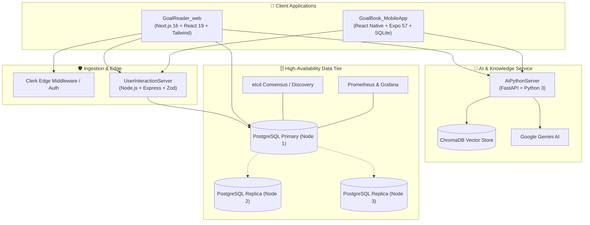

# 📖 GoalBook — Microservices Platform

<p align="center">
  <strong>An enterprise-grade, AI-powered reading and knowledge extraction ecosystem built with modern microservices.</strong>
</p>

<p align="center">
  
  
  
  
  
  
</p>

---

## 🌟 Executive Summary

**GoalBook** is an intelligent reading, learning, and knowledge platform. It solves a real problem: reading dense technical books and study materials can be slow and tiring. 

GoalBook combines **voice-assisted speed reading**, **AI document analysis**, and **cross-platform synchronization** into a unified ecosystem. Whether on desktop or mobile, readers can listen with karaoke-style text highlighting, ask questions about any page, extract technical diagrams, and build personal vocabulary libraries with zero lag.

---

## 🏛️ System Architecture

The platform is designed around five decoupled, scalable microservices and clients:



---

## 📦 Projects & Services Breakdown

| Service | Technology Stack | Role & Responsibility | Port |
| :--- | :--- | :--- | :--- |
| **`AiPythonServer`** | Python 3, FastAPI, ChromaDB, Google Gemini, PyMuPDF | Document parsing, RAG question-answering, diagram extraction, and automated quiz generation | `8000` |
| **`GoalBook_DB`** | PostgreSQL 15, Docker Compose, etcd, Prometheus, Grafana, Prisma | High-availability replicated database cluster with automated failover and monitoring | `5432` |
| **`GoalReader_web`** | Next.js 16 (App Router), React 19, Tailwind CSS v4, Clerk, ImageKit | Full-featured web application with karaoke RSVP reader, AI research assistant, and library dashboard | `3000` |
| **`GoalBook_MobileApp`** | React Native, Expo 57, Redux Toolkit, SQLite, Biometrics, Jest | Cross-platform mobile app with offline-first reading, biometric login, and secure token storage | `8081` |
| **`UserInteractionServer`** | Node.js, Express, TypeScript, Zod, Pino Logger, Helmet | High-throughput event ingestion service tracking user interactions, reading telemetry, and bookmarks | `5000` |

---

### 1. 🧠 `AiPythonServer` — AI & Document Intelligence

A specialized Python FastAPI service powering the platform's Retrieval-Augmented Generation (RAG) capabilities.

- **Automated Book Ingestion**: Extracts text, page hierarchies, and technical diagrams directly from uploaded PDFs using PyMuPDF.
- **Semantic Vector Search**: Generates vector embeddings for book chapters and stores them in **ChromaDB**.
- **Context-Aware Q&A (`/ask`)**: Uses **Google Gemini** to answer complex questions about books with verified citations and source paragraphs.
- **Page-Level Comprehension (`/page-questions`)**: Generates targeted study questions for any given page to test reader understanding.
- **Diagram & Figure Extraction**: Automatically isolates architectural diagrams and flowcharts from books for visual reference.

```bash
# Key Endpoints
POST /upload-pdf       # Uploads PDF, indexes vector embeddings, extracts figures
POST /ask              # Semantic Q&A over indexed documents using Gemini
POST /page-questions   # Generates 5 key study questions for a specific page
GET  /health           # Health check probe
```

---

### 2. 🗄️ `GoalBook_DB` — Distributed High-Availability Database

An enterprise database architecture built for fault tolerance, zero data loss, and real-time observability.

- **3-Node PostgreSQL Cluster**: Configured with primary-replica streaming replication for read-heavy scaling and high availability.
- **Service Discovery & Consensus (`etcd`)**: Coordinates cluster health, automated leader election, and failover management.
- **Full Observability Stack**: Pre-configured **Prometheus** metrics exporter and **Grafana** dashboard for database query performance and replication lag monitoring.
- **Prisma ORM Models**: Type-safe relational schemas covering `Users`, `Books`, `ReadingProgress`, `SavedWords`, `AIChatHistory`, and `Interactions`.
- **Automated Scripts**: Includes test harnesses (`test-replication.sh`, `monitor.sh`, `setup.sh`) to verify failover in seconds.

---

### 3. 💻 `GoalReader_web` — Full-Stack Web Reader & AI Workspace

The primary desktop and browser interface built with **Next.js 16** and **React 19**.

- **Synchronized Karaoke Reader**: Real-time text highlighting synchronized with the Web Speech API and RSVP (Rapid Serial Visual Presentation) speed engine.
- **5-Tier Hybrid Storage Architecture**:
  1. *L1 Active Memory*: In-memory React state (< 1ms latency).
  2. *L2 Metadata Cache*: LocalStorage for quick reader settings (< 2ms).
  3. *L3 Offline Storage*: Client-side **IndexedDB** for full offline book access (< 15ms).
  4. *L4 Object Cloud*: **ImageKit CDN** for encrypted cloud PDF storage.
  5. *L5 Relational Cloud*: **PostgreSQL** for user bookmarks, vocabulary, and stats.
- **AI Research Drawer**: Slide-out assistant for instant definitions, summaries, and deep document research without leaving the reading screen.
- **Vocabulary Builder**: Click on any unfamiliar word to view definitions, save to a personal dictionary, and review later.
- **Enterprise Security**: Edge middleware route protection using **Clerk Authentication**.

---

### 4. 📱 `GoalBook_MobileApp` — Cross-Platform Mobile Application

A production-ready mobile application built using **React Native** and **Expo 57**.

- **Offline-First Architecture**: Powered by **Expo SQLite** and `expo-file-system`, allowing users to read, highlight, and track progress without internet connectivity.
- **Biometric Authentication**: Secure fingerprint and FaceID login using `expo-local-authentication` and encrypted credentials via `expo-secure-store`.
- **State Management**: **Redux Toolkit** for predictable UI state coupled with **TanStack React Query** for server caching.
- **Audio & Haptics**: Text-to-speech integration via `expo-speech` with tactile haptic feedback during speed reading.
- **Quality Assurance**: Comprehensive unit and component testing with **Jest**, plus End-to-End (E2E) test automation with **Cypress**.

---

### 5. ⚡ `UserInteractionServer` — Event & Telemetry Microservice

A lightweight, robust Node.js/TypeScript backend service designed for event tracking.

- **Strict Type Safety**: All incoming payloads are validated at runtime using **Zod schemas**.
- **Action Ingestion**: Captures user interactions (`like`, `comment`, `share`, `view`, `bookmark`, `follow`) with flexible JSON metadata.
- **Production Hardening**: Equipped with **Helmet** HTTP security headers, CORS origin whitelisting, and structured **Pino JSON logging**.
- **Predictable Error Handling**: Centralized error middleware with standardized HTTP response formats and status codes.

---

## 📂 Repository Directory Layout

```text
GoalBook_Servers/
├── AiPythonServer/                  # Python AI & Document Intelligence Service
│   ├── Classes/                     # PDF extraction and vector indexing classes
│   ├── chunks/                      # Text chunking, Gemini Q&A, and search scripts
│   ├── api.py                       # FastAPI application & REST endpoints
│   ├── .env.example                 # Environment variable template
│   └── requirements.txt             # Python dependencies
│
├── GoalBook_DB/                     # Database Cluster & Infrastructure
│   ├── configs/                     # PostgreSQL & etcd configuration templates
│   ├── prisma/                      # Prisma schema and migration definitions
│   ├── scripts/                     # Cluster initialization SQL scripts
│   ├── docker-compose.yml           # 3-node PostgreSQL, etcd, Prometheus, Grafana
│   ├── setup.sh                     # Cluster bootstrap script
│   ├── monitor.sh                   # Real-time replication monitor
│   └── test-replication.sh         # Failover and replication verification test
│
├── GoalBook_MobileApp/              # React Native / Expo Mobile App
│   ├── app/                         # Expo file-based router pages
│   ├── src/                         # Reusable components, hooks, slices, and services
│   │   ├── services/                # Biometrics, SQLite, storage, and API clients
│   │   ├── store/                   # Redux Toolkit store and feature slices
│   │   └── utils/                   # Speed calculators, formatters, and validators
│   ├── cypress/                     # End-to-End mobile web testing suite
│   ├── app.json                     # Expo configuration
│   ├── package.json                 # Mobile dependencies and test scripts
│   └── tsconfig.json                # TypeScript compiler configuration
│
├── GoalReader_web/                  # Next.js 16 Web Application
│   ├── app/                         # App Router (Marketing, Auth, Dashboard, Reader)
│   ├── components/                  # Karaoke display, PDF uploader, Navbar, Sidebar
│   ├── hooks/                       # useVocalReader state machine hook
│   ├── lib/                         # PDF parser engine, Prisma client, ImageKit SDK
│   ├── prisma/                      # Web application database schema
│   ├── docs/                        # Architecture and API documentation
│   ├── package.json                 # Web dependencies
│   └── next.config.ts               # Next.js configuration
│
├── UserInteractionServer/          # Event & Analytics Microservice
│   ├── src/
│   │   ├── controllers/             # Request handling logic
│   │   ├── middlewares/             # Error handling, validation, logging
│   │   ├── routes/                  # Express REST routes
│   │   ├── schemas/                 # Zod validation schemas
│   │   ├── server.ts                # Server bootstrap & lifecycle
│   │   └── app.ts                   # Express application setup
│   ├── package.json                 # Node dependencies
│   └── tsconfig.json                # TypeScript compiler configuration
│
├── .gitignore                       # Universal ignore rules (Secrets & builds protected)
└── README.md                        # Project documentation
```

---

## 🚀 Quick Start Guide

### Prerequisites

- **Node.js**: `v20.x` or later & `npm`
- **Python**: `v3.10` or later & `pip`
- **Docker & Docker Compose**: For database and monitoring services
- **Git**

---

### Step 1: Start the Database Cluster (`GoalBook_DB`)

```bash
cd GoalBook_DB
docker compose up -d

# Verify replication health
./monitor.sh
```

---

### Step 2: Start the AI Service (`AiPythonServer`)

```bash
cd ../AiPythonServer

# Create and activate Python virtual environment
python3 -m venv .venv
source .venv/bin/activate

# Install dependencies
pip install -r requirements.txt   # or: pip install fastapi uvicorn google-genai chromadb pydantic pymupdf

# Set your Gemini API key in .env
cp .env.example .env
# Edit .env with your GEMINI_API_KEY

# Start server
uvicorn api:app --reload --port 8000
```

---

### Step 3: Start the Event Server (`UserInteractionServer`)

```bash
cd ../UserInteractionServer
npm install
cp .env.example .env
npm run dev
```

---

### Step 4: Start the Web Application (`GoalReader_web`)

```bash
cd ../GoalReader_web
npm install
cp .env.example .env
npm run dev
# Open http://localhost:3000 in your browser
```

---

### Step 5: Start the Mobile Application (`GoalBook_MobileApp`)

```bash
cd ../GoalBook_MobileApp
npm install
cp .env.example .env
npx expo start
# Press 'a' for Android, 'i' for iOS Simulator, or 'w' for Web Preview
```

---

## 🛡️ Security & Best Practices

- **Zero Secrets in Source Control**: All sensitive credentials, API keys, and database passwords are kept in local `.env` files which are strictly excluded by the top-level `.gitignore`.
- **Edge Authentication**: Clerk middleware enforces token verification on all protected routes prior to execution.
- **Tenant Isolation**: Cloud storage directories and database queries are strictly partitioned by authenticated `userId`.
- **Defensive Error Handling**: Microservices utilize structured error envelopes and schema-driven input validation to prevent injection attacks and runtime crashes.

---

## 👨‍💻 Engineering Highlights for Interviewers

1. **System Design & Decoupling**: Each service has a single responsibility. The heavy computation (AI vector indexing and PDF diagram extraction) is isolated in Python, while the user-facing web and mobile experiences run on high-performance TypeScript stacks.
2. **Resilience & Offline First**: If the network disconnects, users can continue reading without interruption. Mobile users utilize SQLite; web users utilize IndexedDB. Data synchronizes back to the cloud automatically when connectivity is restored.
3. **Database Engineering**: Rather than relying on a simple single-node database, GoalBook demonstrates production-level distributed database knowledge with a 3-node PostgreSQL replication cluster, health monitoring with Prometheus, and automated failover discovery.
4. **End-to-End Type Safety**: Shared TypeScript interfaces across frontends and backends, combined with Zod schema validation at runtime and Prisma at the database layer, eliminate entire classes of runtime errors.

---

<p align="center">
  Built with ❤️ by <strong>Kartik</strong> • <a href="https://github.com/kartikgetitnow-spec/GoalBook_Servers">GoalBook_Servers on GitHub</a>
</p>
